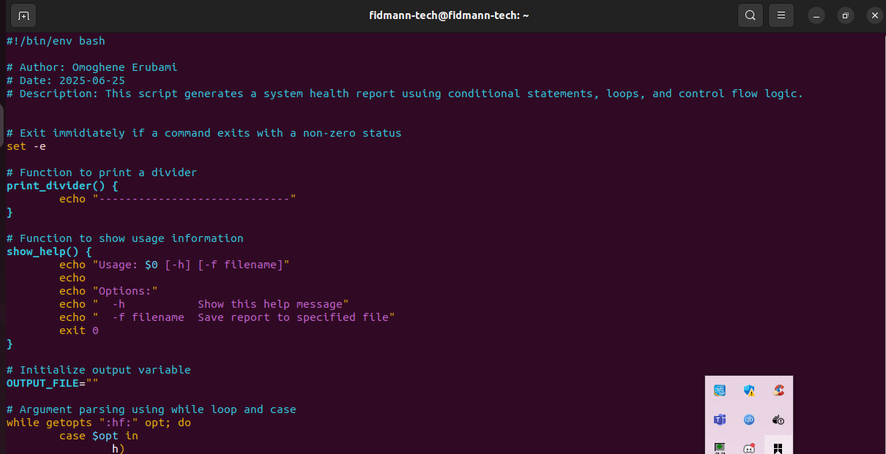
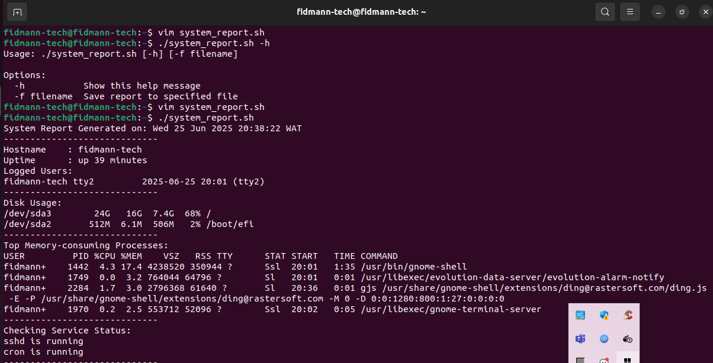

# Linux Control Flow Scripting Project

## 📌 Overview
This project demonstrates the use of **control flow constructs** in Bash scripting — including conditionals, loops, and command-line argument parsing — through a system report automation script.

## 🔧 Features
- Argument parsing (`-h` and `-f`)
- Conditional checks for services
- Loops for evaluating system daemons
- Redirection of output to file if specified
- Robust error handling with `set -e`

## 🛠️ How to Use

## Display
./system_report.sh -h

## Run script and display on terminal
./system_report.sh

## Save output to a file
./system_report.sh -f report.txt

## Below are screenshots of workflow:

